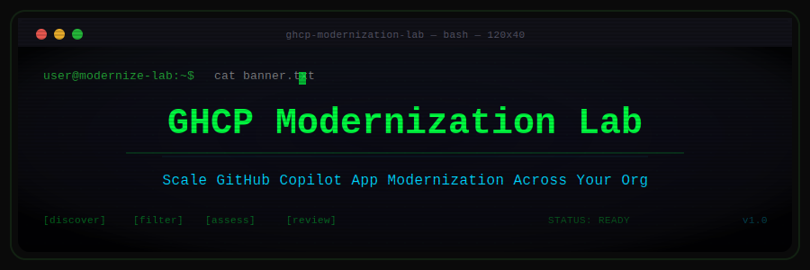
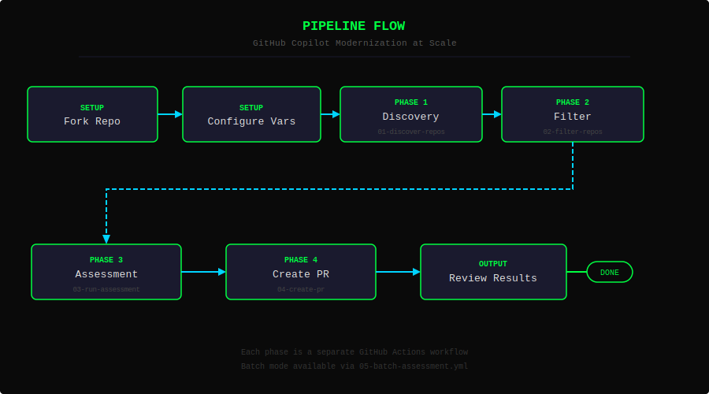
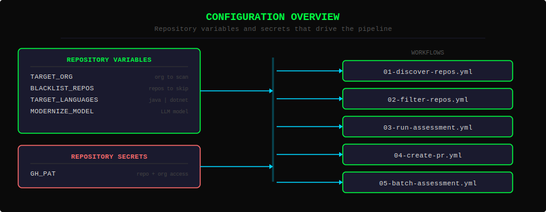
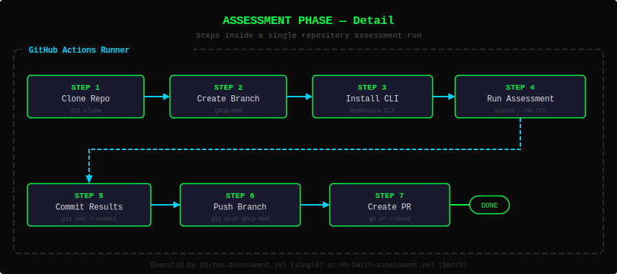

<p align="center">
  
</p>

<p align="center">
  <strong>Learn to run GitHub Copilot App Modernization CLI across an entire GitHub organization using GitHub Actions.</strong>
</p>

<p align="center">
  <a href="#-quick-start">Quick Start</a> •
  <a href="#-step-by-step-lab-guide">Lab Guide</a> •
  <a href="#️-configuration-reference">Configuration</a> •
  <a href="#-workflow-reference">Workflows</a> •
  <a href="#-resources">Resources</a>
</p>

---

## Introduction

This hands-on lab teaches you how to **assess and modernize legacy applications at scale** using the [GitHub Copilot App Modernization CLI](https://github.com/microsoft/modernize-cli) (`modernize`) and [GitHub Actions](https://docs.github.com/en/actions).

### What You'll Learn

- 🔍 **Discover** every repository in a GitHub organization automatically
- 🎯 **Filter** targets by language and exclude repos with a blacklist
- 📊 **Assess** legacy codebases for modernization readiness using AI
- 📬 **Deliver** assessment results as Pull Requests for team review
- 🔄 **Batch** the entire pipeline across dozens (or hundreds) of repos

### What Is the Modernization CLI?

The `modernize` CLI is a command-line tool from Microsoft that uses large language models to analyze legacy codebases and generate modernization plans. In **headless mode** (`--no-tty`), it can run unattended — perfect for CI/CD automation.

Key headless commands:

```bash
# Assess a legacy codebase
modernize assess --source ./my-app --output-path ./results --no-tty

# Create a modernization plan
modernize plan create "Migrate from Java 8 to Java 21" --no-tty
```

---

## How It Works

<p align="center">
  
</p>

> 📸 [View: Pipeline Overview — Full Architecture Diagram](assets/screenshots/00-pipeline-overview.html)
> *Open the HTML file in a browser to view the syntax-highlighted rendering.*

This lab builds a **four-phase pipeline**using GitHub Actions workflows:

| Phase | Workflow | What It Does |
|-------|----------|--------------|
| **1. Discover** | `01-discover-repos.yml` | Lists every repo in the target org with language metadata |
| **2. Filter** | `02-filter-repos.yml` | Applies blacklist and language filters to select targets |
| **3. Assess** | `03-run-assessment.yml` | Clones a repo, runs `modernize assess`, commits the results |
| **4. PR** | `04-create-pr.yml` | Opens a Pull Request with the assessment report |
| **Batch** | `05-batch-assessment.yml` | Orchestrates phases 1–4 across all filtered repos |

Each workflow can run independently (great for learning) or as part of the batch pipeline (great for production).

---

## Prerequisites

Before you begin, make sure you have:

- [ ] A **GitHub account** with permissions to create organizations (free tier works!)
- [ ] A **GitHub Copilot license** with App Modernization access enabled
- [ ] **GitHub CLI** (`gh`) installed — [install guide](https://cli.github.com/)
- [ ] Basic familiarity with **GitHub Actions** (you'll learn as you go!)

> 💡 **Tip:** You don't need the `modernize` CLI installed locally — the workflows install it automatically on the GitHub Actions runner.

---

## 🚀 Quick Start

Already comfortable with GitHub Actions? Here's the fast path:

```bash
# 1. Fork this repo to your target org
gh repo fork EmeaAppGbb/AppModLab-ghactions-scale-ghcp-mod \
  --org YOUR_ORG --clone

# 2. Fork the sample legacy projects into the same org
gh repo fork EmeaAppGbb/AppModLab-java-8to21-AssetsManager-spec2cloud \
  --org YOUR_ORG
gh repo fork EmeaAppGbb/AppModLab-dotnet-4to10-contosouniversity-spec2cloud \
  --org YOUR_ORG

# 3. Create a Personal Access Token with repo + read:org scopes
# Then add it as a repository secret:
gh secret set GH_PAT --repo YOUR_ORG/AppModLab-ghactions-scale-ghcp-mod

# 4. Set repository variables
gh variable set TARGET_ORG --body "YOUR_ORG" \
  --repo YOUR_ORG/AppModLab-ghactions-scale-ghcp-mod
gh variable set TARGET_LANGUAGES --body "both" \
  --repo YOUR_ORG/AppModLab-ghactions-scale-ghcp-mod

# 5. Run the discovery workflow
gh workflow run 01-discover-repos.yml \
  --repo YOUR_ORG/AppModLab-ghactions-scale-ghcp-mod
```

> ⚠️ **Replace `YOUR_ORG`** with the name of your GitHub organization throughout.

Now continue to the [Step-by-Step Lab Guide](#-step-by-step-lab-guide) for detailed explanations, or jump straight to [Batch Processing](#step-9-batch-processing) if you're feeling confident.

---

## 📋 Step-by-Step Lab Guide

Follow these steps in order. Each one builds on the last, and we'll explain what's happening at every stage.

---

### Step 1: Create Your Test Organization

We recommend a **dedicated test organization** so you can experiment freely without affecting production repos.

1. Go to [github.com/organizations/plan](https://github.com/organizations/plan)
2. Choose the **Free** plan
3. Name your org something memorable (e.g., `my-mod-lab`)
4. Complete the setup wizard

> 💡 **Tip:** A separate org gives you a clean target list and keeps your real repos safe from accidental assessment runs.

> ⚠️ **Warning:** If you use an existing org, the discovery workflow will list *all* repos. Use the blacklist variable (`BLACKLIST_REPOS`) to exclude repos you don't want assessed.

---

### Step 2: Fork This Repository

Fork this lab repository into your new organization:

**Option A — GitHub CLI (recommended):**

```bash
gh repo fork EmeaAppGbb/AppModLab-ghactions-scale-ghcp-mod \
  --org YOUR_ORG --clone
```

**Option B — GitHub UI:**

1. Click the **Fork** button at the top of this repository
2. Under "Owner," select your new organization
3. Click **Create fork**

If you used the CLI with `--clone`, you now have a local copy too. Otherwise, clone it:

```bash
gh repo clone YOUR_ORG/AppModLab-ghactions-scale-ghcp-mod
cd AppModLab-ghactions-scale-ghcp-mod
```

---

### Step 3: Add Sample Legacy Projects

Fork the sample legacy repos into the **same organization** so the workflows can discover them:

```bash
# Java 8 → 21 sample (Assets Manager application)
gh repo fork EmeaAppGbb/AppModLab-java-8to21-AssetsManager-spec2cloud \
  --org YOUR_ORG

# .NET Framework 4 → .NET 10 sample (Contoso University)
gh repo fork EmeaAppGbb/AppModLab-dotnet-4to10-contosouniversity-spec2cloud \
  --org YOUR_ORG
```

#### What's Inside These Repos?

| Sample Repo | Source Stack | Target Stack | Why It's a Good Test |
|-------------|-------------|-------------|---------------------|
| **AssetsManager** | Java 8, Spring | Java 21 | Uses deprecated APIs, old dependency versions, pre-module-system patterns |
| **Contoso University** | .NET Framework 4 | .NET 10 | Classic MVC app with Entity Framework 6, Web.config, Global.asax |

These are intentionally "stuck in time" — real-world patterns you'll encounter in legacy modernization.

---

### Step 4: Configure Repository Variables


<p align="center">
  
</p>

Navigate to your forked repo's **Settings → Secrets and variables → Actions** to configure the following.

#### 4a. Create a Personal Access Token (PAT)

The workflows need a PAT to access repos across your organization.

1. Go to [github.com/settings/tokens](https://github.com/settings/tokens?type=beta) (or use classic tokens)
2. Click **Generate new token (classic)**
3. Give it a descriptive name (e.g., `mod-lab-pat`)
4. Select these scopes:
   - ✅ `repo` — Full control of private repositories
   - ✅ `read:org` — Read org membership
5. Set an expiration (e.g., 7 days for a lab)
6. Click **Generate token** and **copy the value immediately**

Now add it as a repository secret:

```bash
gh secret set GH_PAT --repo YOUR_ORG/AppModLab-ghactions-scale-ghcp-mod
# Paste your token when prompted
```

Or via the GitHub UI: **Settings → Secrets and variables → Actions → New repository secret**

#### 4b. Set Repository Variables

```bash
# Required: The organization to scan for legacy repos
gh variable set TARGET_ORG --body "YOUR_ORG" \
  --repo YOUR_ORG/AppModLab-ghactions-scale-ghcp-mod

# Optional: Repos to skip (comma-separated, no spaces)
gh variable set BLACKLIST_REPOS \
  --body "AppModLab-ghactions-scale-ghcp-mod,.github" \
  --repo YOUR_ORG/AppModLab-ghactions-scale-ghcp-mod

# Optional: Filter by language — "java", "dotnet", or "both" (default)
gh variable set TARGET_LANGUAGES --body "both" \
  --repo YOUR_ORG/AppModLab-ghactions-scale-ghcp-mod

# Optional: Specify the LLM model for modernize CLI
gh variable set MODERNIZE_MODEL --body "claude-sonnet-4.6" \
  --repo YOUR_ORG/AppModLab-ghactions-scale-ghcp-mod
```

> 💡 **Tip:** We recommend blacklisting the lab repo itself (`AppModLab-ghactions-scale-ghcp-mod`) so the workflows don't try to assess their own YAML files!

<details>
<summary>📖 Variable reference (click to expand)</summary>

| Variable | Required | Default | Description |
|----------|----------|---------|-------------|
| `TARGET_ORG` | ✅ Yes | — | The GitHub organization to scan for repositories |
| `BLACKLIST_REPOS` | No | — | Comma-separated repo names to exclude from processing |
| `TARGET_LANGUAGES` | No | `both` | Filter: `java`, `dotnet`, or `both` |
| `MODERNIZE_MODEL` | No | — | LLM model override (e.g., `claude-sonnet-4.6`) |

</details>

---

### Step 5: Phase 1 — Discovery


Time to see the pipeline in action! Start by discovering what repos exist in your org.

#### Run the Workflow

```bash
gh workflow run 01-discover-repos.yml \
  --repo YOUR_ORG/AppModLab-ghactions-scale-ghcp-mod
```

> 📸 [View: Discover Repos Workflow Source](assets/screenshots/01-discover-repos.html)
> *Open the HTML file in a browser to view the syntax-highlighted rendering of `01-discover-repos.yml`.*

Or via the GitHub UI: **Actions → 01 - Discover Repos → Run workflow**

#### Watch It Run

```bash
# Check workflow status
gh run list --workflow=01-discover-repos.yml \
  --repo YOUR_ORG/AppModLab-ghactions-scale-ghcp-mod

# Watch the live logs
gh run watch --repo YOUR_ORG/AppModLab-ghactions-scale-ghcp-mod
```

#### What to Expect

The discovery workflow queries the GitHub API and produces a list of all repositories in `TARGET_ORG` along with their primary language. You should see output like:

<details>
<summary>📋 Example discovery output (click to expand)</summary>

```
🔍 Discovering repositories in organization: YOUR_ORG

Found 3 repositories:

  REPO                                                          LANGUAGE
  ──────────────────────────────────────────────────────────────────────────
  AppModLab-ghactions-scale-ghcp-mod                            (workflows)
  AppModLab-java-8to21-AssetsManager-spec2cloud                 Java
  AppModLab-dotnet-4to10-contosouniversity-spec2cloud           C#

✅ Discovery complete. 3 repositories found.
```

</details>

> 💡 **Tip:** If you see 0 repos, double-check that `TARGET_ORG` is set correctly and that your `GH_PAT` has `read:org` scope.

---

### Step 6: Phase 2 — Filter & Prepare


Now let's narrow the list down to repos that should actually be assessed.

#### Run the Workflow

```bash
gh workflow run 02-filter-repos.yml \
  --repo YOUR_ORG/AppModLab-ghactions-scale-ghcp-mod
```

> 📸 [View: Filter Repos Workflow Source](assets/screenshots/02-filter-repos.html)
> *Open the HTML file in a browser to view the syntax-highlighted rendering of `02-filter-repos.yml`.*

#### What Filtering Does

The filter workflow applies two layers:

1. **Blacklist** — Removes repos listed in `BLACKLIST_REPOS`
2. **Language filter** — Keeps only repos matching `TARGET_LANGUAGES`

#### Example: Filter Java-Only

```bash
# Update the language filter to Java only
gh variable set TARGET_LANGUAGES --body "java" \
  --repo YOUR_ORG/AppModLab-ghactions-scale-ghcp-mod

# Re-run the filter workflow
gh workflow run 02-filter-repos.yml \
  --repo YOUR_ORG/AppModLab-ghactions-scale-ghcp-mod
```

<details>
<summary>📋 Example filter output (click to expand)</summary>

```
🎯 Filtering repositories...

  Blacklisted: AppModLab-ghactions-scale-ghcp-mod (skipped)
  Language filter: java

  TARGET REPOS:
  ──────────────────────────────────────────────────────────────────
  ✅ AppModLab-java-8to21-AssetsManager-spec2cloud    Java
  ❌ AppModLab-dotnet-4to10-contosouniversity-spec2cloud  C# (filtered out)

✅ Filtering complete. 1 target repository.
```

</details>

> 💡 **Tip:** Set `TARGET_LANGUAGES` back to `both` when you're ready to assess everything:
> ```bash
> gh variable set TARGET_LANGUAGES --body "both" \
>   --repo YOUR_ORG/AppModLab-ghactions-scale-ghcp-mod
> ```

---

### Step 7: Phase 3 — Assessment


This is where the magic happens. The assessment workflow clones a target repo, runs `modernize assess`, and commits the results to a new branch.

<p align="center">
  
</p>

#### Run on a Single Repo First

Start with one repo to see the full flow before batching:

```bash
gh workflow run 03-run-assessment.yml \
  --repo YOUR_ORG/AppModLab-ghactions-scale-ghcp-mod \
  -f target_repo="AppModLab-java-8to21-AssetsManager-spec2cloud"
```

> 📸 [View: Run Assessment Workflow Source](assets/screenshots/03-run-assessment.html)
> *Open the HTML file in a browser to view the syntax-highlighted rendering of `03-run-assessment.yml`.*

#### What Happens Under the Hood

1. **Clone** — The workflow clones the target repo
2. **Branch** — Creates a `ghcp-mod` branch
3. **Assess** — Runs `modernize assess --source . --output-path ./mod-assessment --no-tty`
4. **Commit** — Commits the assessment results to the branch
5. **Push** — Pushes the branch back to the target repo

#### Understanding the Assessment Output

The `modernize assess` command generates a structured report that includes:

- **Application overview** — What the app does, its architecture
- **Technology inventory** — Frameworks, libraries, and their versions
- **Migration complexity** — Risk assessment and effort estimates
- **Recommended migration path** — Step-by-step modernization strategy

<details>
<summary>📋 Example assessment summary (click to expand)</summary>

```
📊 Assessment Report: AssetsManager

  Application Type:     Spring MVC Web Application
  Source Platform:       Java 8, Spring Framework 4.x
  Target Platform:       Java 21, Spring Boot 3.x

  Complexity:           MODERATE
  Estimated Effort:     40-60 hours

  Key Findings:
    ⚠️  12 deprecated API usages detected
    ⚠️  javax.* namespace requires migration to jakarta.*
    ⚠️  Spring Security configuration uses legacy WebSecurityConfigurerAdapter
    ✅  No native code or JNI dependencies
    ✅  Standard Maven build structure
```

</details>

> ⚠️ **Warning:** Assessment times vary based on repository size. A small repo might take 2–3 minutes; larger codebases could take 10+ minutes.

---

### Step 8: Phase 4 — PR & Review


Now let's package the assessment into a Pull Request so the team can review it.

#### Run the Workflow

```bash
gh workflow run 04-create-pr.yml \
  --repo YOUR_ORG/AppModLab-ghactions-scale-ghcp-mod \
  -f target_repo="AppModLab-java-8to21-AssetsManager-spec2cloud"
```

> 📸 [View: Create PR Workflow Source](assets/screenshots/04-create-pr.html)
> *Open the HTML file in a browser to view the syntax-highlighted rendering of `04-create-pr.yml`.*

#### What Happens

The workflow creates a PRin the **target repo** (not this repo) from the `ghcp-mod` branch to the default branch. The PR contains:

- The full assessment report
- Modernization recommendations
- A summary comment with next steps

#### Reviewing the PR

1. Go to the target repo (e.g., `YOUR_ORG/AppModLab-java-8to21-AssetsManager-spec2cloud`)
2. Open the **Pull Requests** tab
3. Review the assessment report in the PR diff
4. Decide on next steps:
   - **Approve** — You agree with the assessment and want to proceed
   - **Comment** — Ask questions or request a re-assessment
   - **Close** — The repo doesn't need modernization right now

> 💡 **Tip:** The PR is a discussion starting point, not an automatic merge. Use it to align your team on modernization priorities.

---

### Step 9: Batch Processing

Ready to scale? The batch workflow orchestrates the entire pipeline across all filtered repos.

#### Run the Batch Workflow

```bash
gh workflow run 05-batch-assessment.yml \
  --repo YOUR_ORG/AppModLab-ghactions-scale-ghcp-mod
```

> 📸 [View: Batch Assessment Workflow Source](assets/screenshots/05-batch-assessment.html)
> *Open the HTML file in a browser to view the syntax-highlighted rendering of `05-batch-assessment.yml`.*

#### Safety First: Use `max_repos`

For your first batch run, limit the number of repos processed:

```bash
gh workflow run 05-batch-assessment.yml \
  --repo YOUR_ORG/AppModLab-ghactions-scale-ghcp-mod \
  -f max_repos="2"
```

> ⚠️ **Warning:** Running assessments on a large org can consume significant GitHub Actions minutes. Start small and increase gradually.

#### Monitoring Batch Progress

```bash
# Watch the batch workflow
gh run watch --repo YOUR_ORG/AppModLab-ghactions-scale-ghcp-mod

# List recent runs across all workflows
gh run list --repo YOUR_ORG/AppModLab-ghactions-scale-ghcp-mod --limit 20
```

The batch workflow will:
1. Run discovery (Phase 1)
2. Apply filters (Phase 2)
3. Assess each filtered repo (Phase 3)
4. Create PRs for each assessment (Phase 4)

When it's done, you'll have a PR in each target repo with its modernization assessment. 🎉

---

## ⚙️ Configuration Reference

### Repository Variables

Set these in **Settings → Secrets and variables → Actions → Variables**:

| Variable | Required | Default | Example | Description |
|----------|----------|---------|---------|-------------|
| `TARGET_ORG` | ✅ | — | `my-mod-lab` | GitHub organization to scan for repositories |
| `BLACKLIST_REPOS` | ❌ | _(none)_ | `repo-a,repo-b` | Comma-separated list of repo names to skip |
| `TARGET_LANGUAGES` | ❌ | `both` | `java` | Language filter: `java`, `dotnet`, or `both` |
| `MODERNIZE_MODEL` | ❌ | _(CLI default)_ | `claude-sonnet-4.6` | LLM model for the `modernize` CLI |

### Repository Secrets

Set these in **Settings → Secrets and variables → Actions → Secrets**:

| Secret | Required | Description |
|--------|----------|-------------|
| `GH_PAT` | ✅ | Personal Access Token with `repo` and `read:org` scopes |

---

## 🔧 Workflow Reference

| Workflow | File | Trigger | Description |
|----------|------|---------|-------------|
| **Discover Repos** | `01-discover-repos.yml` | `workflow_dispatch` | Lists all repos in `TARGET_ORG` with language metadata |
| **Filter Repos** | `02-filter-repos.yml` | `workflow_dispatch` | Applies blacklist and language filters; outputs target list |
| **Run Assessment** | `03-run-assessment.yml` | `workflow_dispatch` | Clones target repo, runs `modernize assess`, commits to `ghcp-mod` branch |
| **Create PR** | `04-create-pr.yml` | `workflow_dispatch` | Creates a PR in target repo with assessment results |
| **Batch Assessment** | `05-batch-assessment.yml` | `workflow_dispatch` | Orchestrates phases 1–4 across all filtered repos |

All workflows use `workflow_dispatch` — you trigger them manually from the **Actions** tab or via the GitHub CLI.

---

## 🔒 Security Considerations

### Personal Access Token (PAT)

- **Least privilege:** Only grant `repo` and `read:org` scopes
- **Short expiration:** Use 7-day (or shorter) tokens for labs
- **Rotate regularly:** Regenerate your PAT after the lab is complete
- **Never commit tokens:** Always use repository secrets

### Branch Protection

- The assessment workflow pushes to a `ghcp-mod` branch, never to `main`
- PRs require review before merging — no automatic code changes
- Consider enabling branch protection rules on target repos for extra safety

### Organization Access

- The `GH_PAT` owner must be a member of `TARGET_ORG`
- For private repos, the PAT needs full `repo` scope
- For public-only orgs, `public_repo` scope is sufficient

> 💡 **Tip:** After completing the lab, revoke or delete the PAT to minimize risk.

---

## 🔗 Resources

| Resource | Link |
|----------|------|
| **Modernization CLI Docs** | [learn.microsoft.com — CLI Commands](https://learn.microsoft.com/en-us/azure/developer/github-copilot-app-modernization/modernization-agent/cli-commands) |
| **Modernize CLI (GitHub)** | [github.com/microsoft/modernize-cli](https://github.com/microsoft/modernize-cli) |
| **Microsoft Learn — App Modernization** | [learn.microsoft.com — GitHub Copilot App Modernization](https://learn.microsoft.com/en-us/azure/developer/github-copilot-app-modernization/) |
| **Sample: Java 8 → 21** | [AppModLab-java-8to21-AssetsManager-spec2cloud](https://github.com/EmeaAppGbb/AppModLab-java-8to21-AssetsManager-spec2cloud) |
| **Sample: .NET 4 → 10** | [AppModLab-dotnet-4to10-contosouniversity-spec2cloud](https://github.com/EmeaAppGbb/AppModLab-dotnet-4to10-contosouniversity-spec2cloud) |
| **GitHub Actions Docs** | [docs.github.com — GitHub Actions](https://docs.github.com/en/actions) |
| **GitHub CLI** | [cli.github.com](https://cli.github.com/) |

---

## 📸 Workflow Screenshots

Syntax-highlighted HTML renderings of each workflow are available in [`assets/screenshots/`](assets/screenshots/). Open them in a browser to view or capture screenshots.

| Screenshot | Workflow |
|-----------|----------|
| [Pipeline Overview](assets/screenshots/00-pipeline-overview.html) | Architecture diagram with all phases and configuration |
| [01 — Discover Repos](assets/screenshots/01-discover-repos.html) | `01-discover-repos.yml` — lists all org repos |
| [02 — Filter & Prepare](assets/screenshots/02-filter-repos.html) | `02-filter-repos.yml` — applies language + blacklist filters |
| [03 — Run Assessment](assets/screenshots/03-run-assessment.html) | `03-run-assessment.yml` — clones, assesses, commits |
| [04 — Create PR](assets/screenshots/04-create-pr.html) | `04-create-pr.yml` — opens PR with assessment results |
| [05 — Batch Assessment](assets/screenshots/05-batch-assessment.html) | `05-batch-assessment.yml` — orchestrates full pipeline |

---

## 📝 License

This project is licensed under the [MIT License](LICENSE).

---

## 🤝 Contributing

We welcome contributions! Here's how to help:

1. **Fork** this repository
2. **Create a branch** for your feature or fix (`git checkout -b feature/my-improvement`)
3. **Commit** your changes with clear messages
4. **Push** to your branch and open a **Pull Request**

### Ideas for Contributions

- 🌍 Add support for more languages (Python, Go, etc.)
- 📖 Improve documentation or add translations
- 🐛 Report bugs or suggest enhancements via [Issues](../../issues)
- 🧪 Add integration tests for the workflows

> 💡 **Tip:** If you're unsure about a change, open an issue first to discuss it!

---

<p align="center">
  <sub>Built with ❤️ for the app modernization community</sub>
</p>
